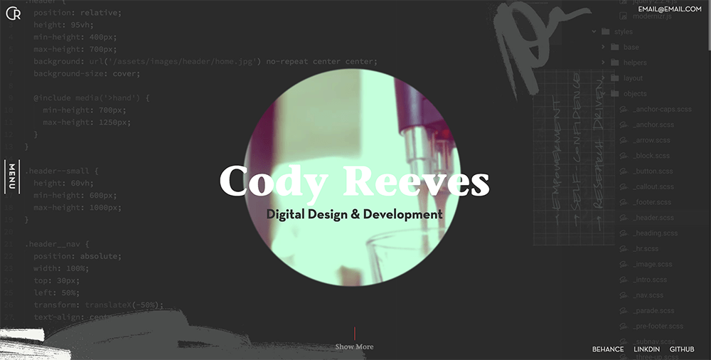
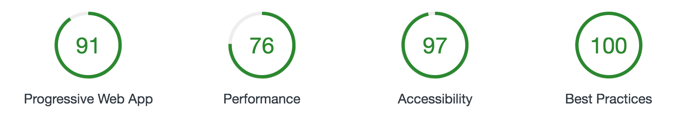
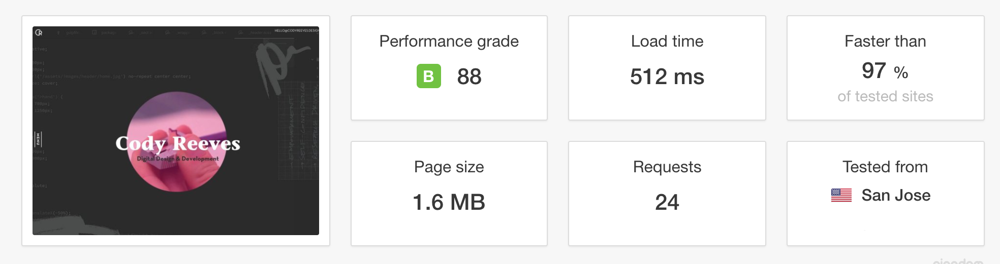

## Cody Reeves Personal Portfoilo
The design, site, all assets are created for Codyreeves.com portfolio and will only be used and/or modified with Cody Reeves permission.

### Specs:

**Hosting & Domain**

Github Pages routed through CloudFlare to domain provider.

**Frameworks & Tools Used**

- React
- Redux
- React Router
- Static Content
- Mixin It - Scss Framework V1.0.0

### Current Site Stats:

**PWA Compliant - Google Standards from Lighthouse**

**Preformance from Pingdom**

